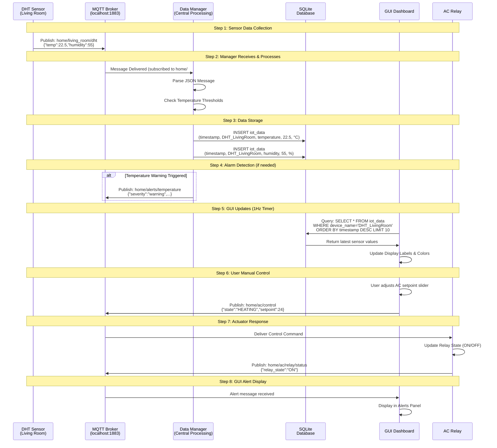
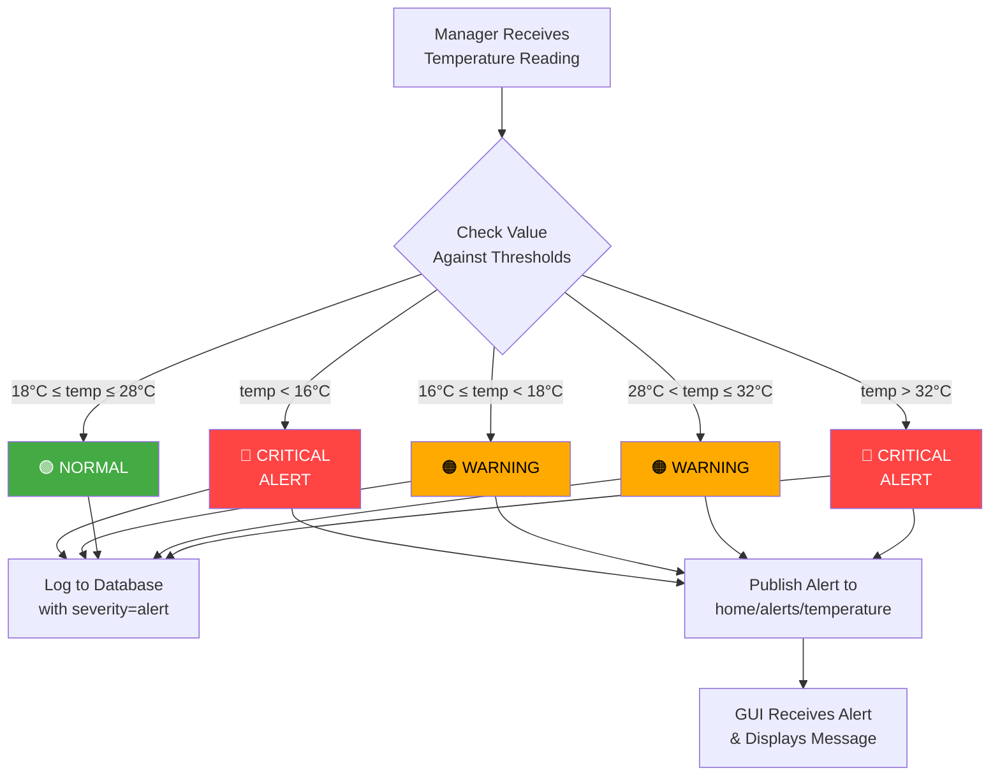
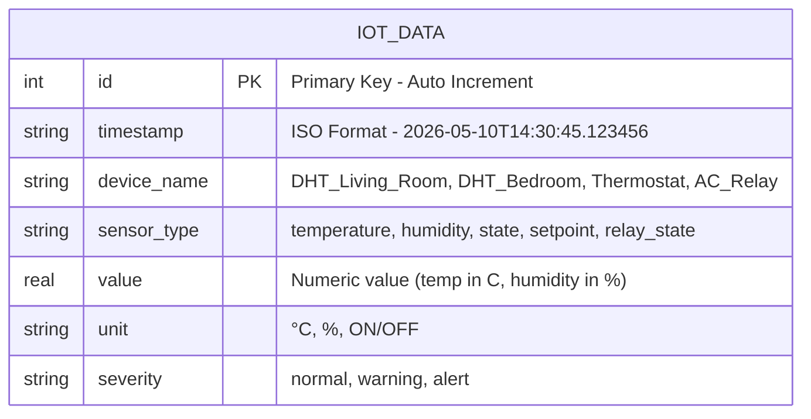

# Data Flow Diagram - Message Processing

## Complete Message Flow



## Temperature Threshold Check Logic



## Database Schema



## Example Data Records

```
id | timestamp                  | device_name        | sensor_type | value  | unit | severity
---|----------------------------|-------------------|-------------|--------|------|----------
 1 | 2026-05-10T14:30:45.123456 | DHT_Living_Room    | temperature | 22.5   | °C   | normal
 2 | 2026-05-10T14:30:45.234567 | DHT_Living_Room    | humidity    | 55.0   | %    | normal
 3 | 2026-05-10T14:30:50.345678 | DHT_Bedroom        | temperature | 20.8   | °C   | normal
 4 | 2026-05-10T14:30:50.456789 | DHT_Bedroom        | humidity    | 60.5   | %    | normal
 5 | 2026-05-10T14:30:55.567890 | Thermostat         | setpoint    | 22.0   | °C   | normal
 6 | 2026-05-10T14:30:55.678901 | AC_Relay           | relay_state | 0      | ON   | normal
 7 | 2026-05-10T14:30:50.000000 | ALERT_SYSTEM       | temperature_alarm | 0 | DHT_Bedroom | warning
```

## Latency Analysis

| Operation                              | Latency    | Notes                    |
| -------------------------------------- | ---------- | ------------------------ |
| Sensor → Broker                        | ~50ms      | Local network            |
| Broker → Manager                       | <10ms      | Instant subscription     |
| Manager Processing                     | ~20ms      | JSON parsing + DB insert |
| DB Storage                             | ~5ms       | SQLite write             |
| **Total: Sensor to DB**                | **~85ms**  | Sub-100ms storage        |
| GUI Query                              | ~10ms      | Simple SELECT query      |
| GUI Display Update                     | ~100ms     | PyQt5 render             |
| **Total: Sensor to GUI**               | **~195ms** | Sub-200ms visibility     |
| User Command to Relay                  | ~150ms     | Publish + receive        |
| **Total E2E: User Action to Actuator** | **~250ms** | Real-time control        |
